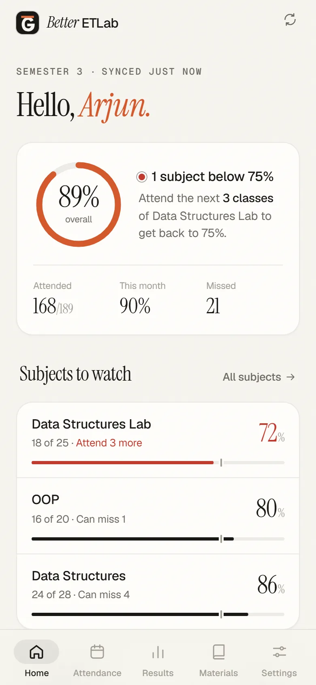
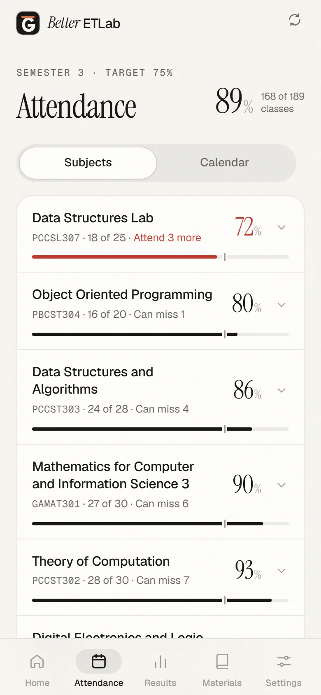
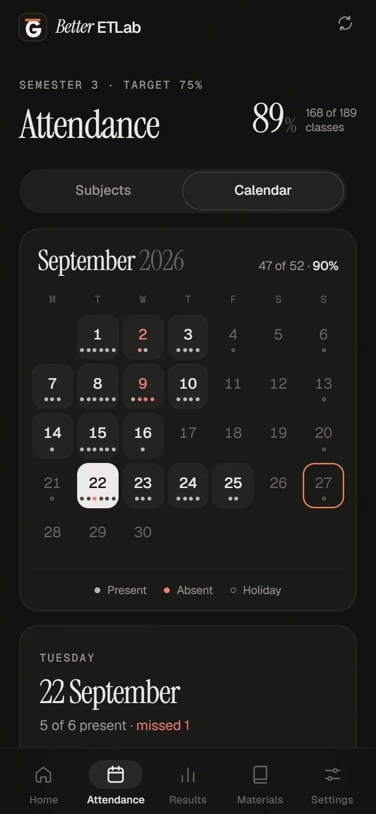
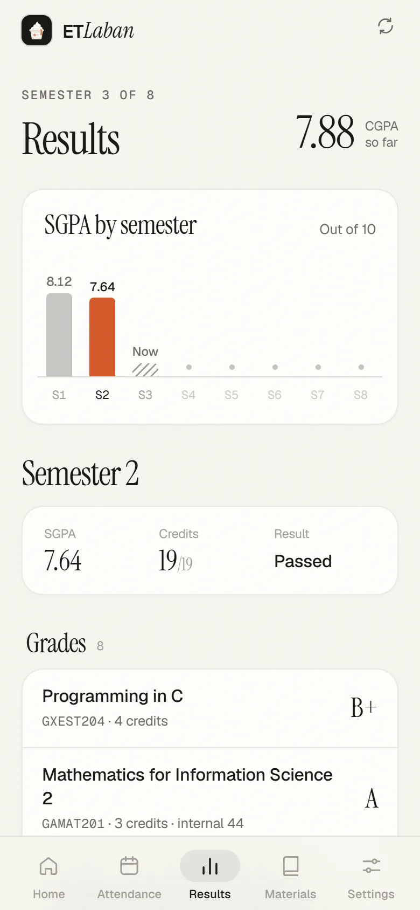
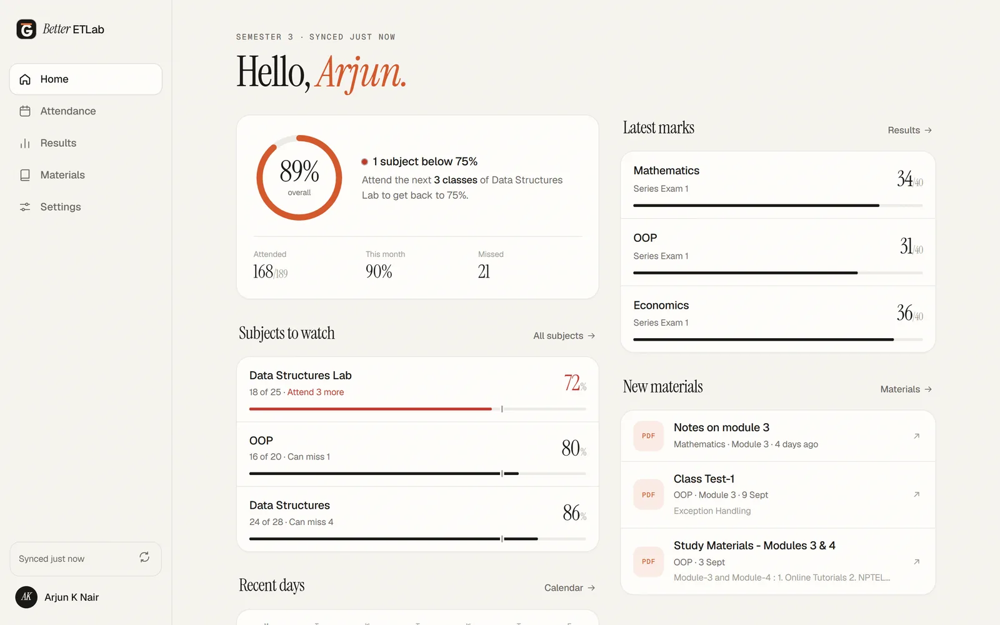

<p align="center">
  
</p>

<h1 align="center">ETLaban</h1>

<p align="center">
  <strong>same data, less suffering.</strong><br />
  A calm, fast app for your attendance, results and study materials.<br />
  Made for students of College of Engineering Trivandrum.
</p>

<p align="center">
  <a href="LICENSE"></a>
  
  
</p>

<p align="center">
  
  
  
  
</p>

<p align="center"><sub>Screenshots use a made-up demo student.</sub></p>

---

## What is this?

ETLab has all your college data, but it is slow and hard to read on a phone.
ETLaban logs in to ETLab for you, reads the same pages you would see,
and shows them in a clean app that works well on your phone.

It is **unofficial**. It only reads your data. It never changes anything on ETLab.

**Why the name?** It's a nod to [Sign Laban](https://www.signlaban.com/), the dessert
shop every CET student knows. ETLab, but sweeter.

## Features

- **Am I in trouble?** The home screen answers it in one line, like
  *"Every subject is above 75%. Tightest is Data Structures Lab, which can miss 3 more classes."*
- **Attendance by subject.** See how many classes you can miss, or how many you need
  to attend to get back above your target.
- **A real calendar.** One small dot per period: dark for present, red for absent.
  Tap a day to see which classes you missed.
- **Results for every semester.** SGPA per semester as a small chart, your CGPA,
  grades, sessional marks and assignments.
- **Study materials.** Every file from ETLab in one searchable list, plus your own
  saved links (Drive folders, playlists, question banks).
- **Your target, your rules.** Choose 75%, 80% or 85%. Every number updates.
- **Light and dark mode.** It follows your phone, or pick one yourself.
- **Install it like an app.** Add it to your home screen. It opens instantly and
  still shows your last data when you're offline.
- **Works on laptops too.** A roomier layout with a sidebar on bigger screens.

<p align="center">
  
</p>

## Is it safe?

This is the most important question, so here is the short answer.

- **Your password is never stored.** It is sent to ETLab once, to log in, and then thrown away.
- **Your data is not stored on the server.** Each time you sync, the server fetches
  your pages from ETLab, turns them into data for the app, and forgets them.
- **Your login stays in your own browser.** It is kept as an encrypted cookie that
  scripts on the page can't read. Every student's session is completely separate.
- **Your data stays on your phone.** The app keeps a copy on your device so it opens
  fast. Logging out deletes it.
- **The code is open.** You can read exactly what it does, right here.

Want the details? See [How it works](docs/how-it-works.md) and the [security policy](SECURITY.md).

## Using it

1. Open the app link in your phone's browser.
2. Log in with your normal ETLab username and password.
3. Wait a few seconds for the first sync.
4. Optional: tap **Install** (or your browser's *Add to Home screen*) to keep it
   on your home screen.

Tap the sync button (the circular arrows) any time to get fresh data. The app
also refreshes by itself if your data is more than 3 hours old.

## Running it on your computer

You need **Python 3.10 or newer**.

```bash
git clone https://github.com/AbhineethVS/better-etlab.git
cd better-etlab
pip install -r requirements.txt
python backend_server.py
```

Then open **http://127.0.0.1:8000** in your browser.

To use it on your phone, connect the phone to the same Wi-Fi and open the
**Phone** address the server prints (something like `http://192.168.1.5:8000`).
On Windows, allow Python through the firewall for private networks if the phone
can't connect.

## Deploying your own copy

The app is ready for [Vercel](https://vercel.com):

1. Import this repository in Vercel. Framework: **Other**. No build command.
2. Add one environment variable: **`SESSION_SECRET`**, a long random value. Generate one with:
   ```bash
   python -c "import secrets; print(secrets.token_urlsafe(48))"
   ```
3. Deploy.

The full guide, with troubleshooting, is in [docs/deployment.md](docs/deployment.md).

## How the project is organised

```text
index.html, login.html, app.html   The three pages: landing, login, and the app
base.css, public.css, app.css      Styles: shared design system, public pages, app
app.js                             The app: views, routing, sync, calendar, charts
landing.js, login.js, auth.js      Page logic and session helpers
ui.js, theme-init.js               Theme switching and small shared behaviour
sw.js, manifest.webmanifest        Installable app (PWA) support

etlab/                             The backend: log in, fetch pages, read them
  api.py                           The API routes
  session.py                       Encrypted session cookie
  client.py                        Talks to ETLab
  attendance.py, results.py,
  materials.py, tables.py          Turn ETLab pages into data

api/index.py                       Entry point on Vercel
backend_server.py                  Entry point on your computer
vercel.json                        Vercel settings and security headers
docs/                              Longer documentation and screenshots
```

## API

All routes return JSON.

| Method | Route             | What it does                                                 |
| ------ | ----------------- | ------------------------------------------------------------ |
| POST   | `/api/login`      | Log in with `{ username, password }`. Sets the session cookie. |
| POST   | `/api/cookie`     | Log in with a pasted ETLab cookie instead (fallback).        |
| POST   | `/api/logout`     | Clear the session cookie.                                    |
| GET    | `/api/me`         | `{ loggedIn, username }`                                     |
| GET    | `/api/attendance` | Subject totals, the month calendar, and each day's periods.  |
| GET    | `/api/results`    | Every semester so far: marks, grades, SGPA and CGPA.         |
| GET    | `/api/materials`  | Notes and files from ETLab.                                  |

If your ETLab session has expired, data routes answer `401` with `"expired": true`,
and the app asks you to log in again.

## Contributing

Bug reports, ideas and pull requests are welcome. Please read
[CONTRIBUTING.md](CONTRIBUTING.md) first. It explains how to set things up and
how to fix things when ETLab changes its pages.

**Never post your password, cookie or real ETLab pages in an issue.**

## Disclaimer

ETLaban is an independent student project. It is not made by, endorsed by,
or connected to ETLab, Etuwa Concepts, College of Engineering Trivandrum, or KTU.
It shows the same data ETLab shows you. Always check ETLab itself for anything
official, like exam eligibility.

## Licence

[MIT](LICENSE). Use it, change it, share it. Just keep the copyright notice.
